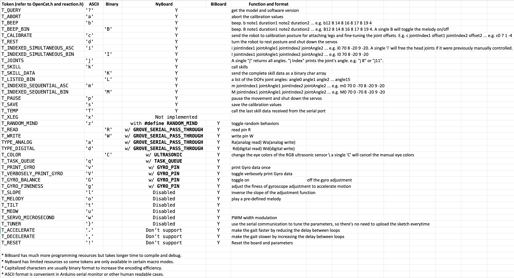

# 🖇️串口协议

我们预先定义了一套串口通信协议，具体指令和参数表如下：&#x20;

<figure><figcaption></figcaption></figure>

所有的命令都是以单个ASCII字符开头，并区分大小写。通常指令为小写。


有的指令，如“c”和“m”是复合命令：

比如：连续命令如：“ m8 40”，“ m8 -35”，“ m 0 50”可以写为“ m8 40 8 -35 0 50”。您可以在代码中更改最大长度限制，但是串口缓冲区可能会有系统的限制。


您可以在[串口监视器](https://docs.petoi.com/v/chinese/arduino-ide/chuan-kou-jian-shi-qi)中尝试输入以下命令，查看实际效果：

* “**k**sit”
* “**m**0 30”
* “**m**0 -30”
* “**k**balance”
* “**k**wkF”
* “**k**trL”
* “**d**”


引号 **“ ”** 只是表示它们是字符串。 请不要在串口监视器中输入引号。


src/OpenCat.h 中包含完整的真正有效的指令类型：

<figure><figcaption></figcaption></figure>

更多可用技能命令如下表所示：

<figure><figcaption></figcaption></figure>

实际生效的技能定义在[InstinctBittle.h](https://github.com/PetoiCamp/OpenCat/blob/main/src/InstinctBittle.h) 或 [InstinctNybble.h](https://github.com/PetoiCamp/OpenCat/blob/main/src/InstinctNybble.h)个表：


```cpp
const char* skillNameWithType[]={"bdFI","bkI","bkLI","crFI","crLI","hlwI","mhFI","mhLI","pcFI","phFI","phLI","trFI","trLI","vtFI","vtLI","wkFI","wkLI","balanceI","buttUpI","calibI","droppedI","liftedI","restI","sitI","strI","zeroN","bfI","ckI","climbCeilI","fdI","ffI","hiI","jyI","pdI","peeI","puI","pu1I","rcI","rlLI","rtI","stpI","tsI",};
```


可以在所有技能的名称前加“k”并删除后缀来调用。比如，表中有一个"sitI" 的技能。可以发送"ksit" 来调用坐下（sit）。如果一个技能名有 "F" 或 "L" 的后缀，就是一个步态，表示向前或向左走。向右走是向左走的镜像，可以用"kwkR"调用。类似地，还有跑步("tr")、爬行("cr")、踏步("vt")等步态。
