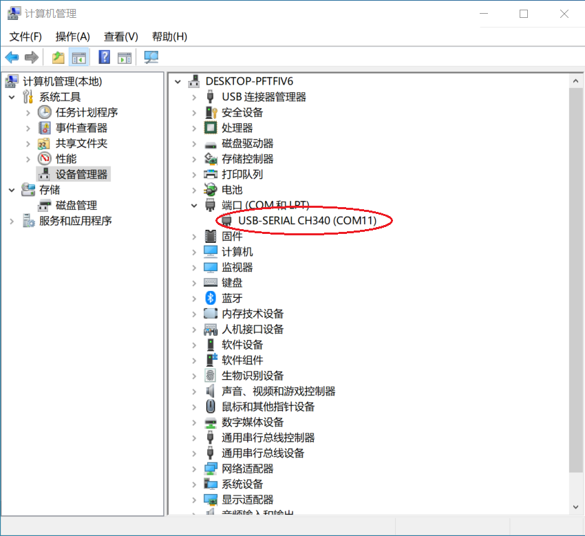
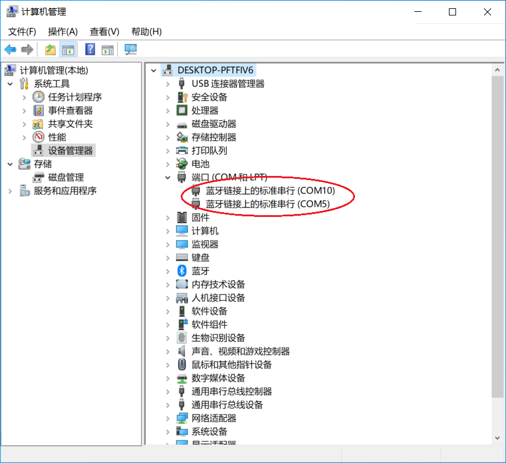

# 🐍 Python serialMaster使用指南

### **准备工作**

1. 安装python 3.6以上版本 （比如Anaconda3-5.2.0-Windows-x86\_64.exe）
2. 安装pyserial库(version: 3.5)

### **运行脚本**

一般情况下，使用[USB串口适配器](https://docs.petoi.com/v/chinese/tong-xin-mo-kuai/usb-xia-zai-mo-kuai-ch340c)连接机器人时，只有一个串口端口号：



使用蓝牙模块时，有两个串口端口号：



打开 Terminal ( 比如Anaconda Prompt)，进入脚本文件所在路径（\*\*\*\serialMaster）,可以使用以下命令运行脚本，脚本在最开始运行时会自动识别口串口端口号，并完成连接。

**方式一：**&#x8FD0;行 **ardSerial.py** 脚本程序

```
***\serialMaster>python3 ardSerial.py kbalance
```

参数：**kbalance** 是一条控制机器人运动的[串口命令](https://docs.petoi.com/v/chinese/chuan-kou-xie-yi)

当然也您可以不带任何参数运行此脚本

```
***\serialMaster>python3 ardSerial.py
```

当系统识别有多个串口端口号，脚本在最开始运行时会自动识别出所有与机器人已正常建立连接所有串口端口号（可以同时给多个机器人发送串口命令），并打印出以下提示信息：

```python
__main__ - INFO - port[0] is COM11
__main__ - INFO - port[1] is COM5
__main__ - INFO - port[2] is COM10
Waiting for the robot to booting up
Waiting for the robot to booting up
['b', '\n* Start *\nBittle\nReady!\np\n']
Adding COM5
['b', '\n* Start *\nBittle\nReady!\np\n']
Adding COM11
__main__ - INFO - Connect to usb serial port:
__main__ - INFO - COM5
__main__ - INFO - COM11
```

程序正式开始运行时，打印出以下提示信息：

```python
You can type 'quit' or 'q' to exit.
```

**您可以键入'quit'或'q'命令退出程序。**

接下来，您就可以在 Terminal 中输入串口命令来控制机器人做各种有意思的动作了😃 比如：

```
Kbalance        # 控制机器人正常站立指令
m 0 -30 0 30    # 控制机器人的头左右摆动
```

**方式二：**&#x8FD0;行自定义脚本程序，比如 **example.py**

```
***\serialMaster>python3 example.py
```

example.py中的列表 **testSchedule** 用来测试各种串口命令，运行以下脚本代码，可以看到 list 中每条串口命令的执行效果：

```
for task in testSchedule:
    wrapper(task)
```

您也可以参考列表 **stepUpSchedule** 的内容（在 **\*\*\*\serialMaster\demos\stepup.py** 中），按照自己的实际需要编写行为列表，实现自己的创意。🤩

<mark style="color:red;">**注意**</mark>：运行 **\*\*\*\serialMaster\demos\\** 路径下的脚本程序时，一定要先使用 <mark style="color:red;">**cd demos**</mark> 命令进入到脚本程序所在路径（**\*\*\*\serialMaster\demos**），再使用 **python3** 命令运行脚本程序&#x20;

（比如：**python3 stepup.py**）


列表 **testSchedule** 中的串口命令说明：

**\['kbalance', 2]**

* kbalance 控制Bittle正常站立指令
* 2 指令执行完成后的延时时间，单位是秒

**\['d', 2]**

* d 机器人变换到休息姿势并关闭舵机的命令
* 2 指令执行完成后的延时时间，单位是秒

**\['c', 2]**

* c 进入校准模式的命令
* 2 表示执行完命令后延时时间，单位是秒。 运动命令完成后，会延时 2 秒后执行下一条命令。

**\['c', \[0, -9], 2]**

* c 进入校准模式的命令
* 0 关节舵机序号
* -9 旋转角度值（此数值表示相对于校准后采用的参考0值），单位是度
* 2 指令执行完成后的延时时间，单位是秒

本例含义：序号为0的关节舵机旋转-9度。 这些运动命令完成后，会延迟 2 秒后执行下一条命令。

使用此格式，可以进入校准模式，校准某个关节舵机的角度。&#x20;


注意：如果要使该命令中的校正值生效，需要在执行该命令后输入“s”命令。


**\['m', \[0, -20], 1.5]**

* m 控制关节舵机转动指令
* 0 关节舵机序号
* -20 旋转角度值（此数值表示相对于校准后采用的参考0值），单位是度
* 1.5 指令执行完成后的延时时间，单位是秒。它可以是一个浮点数。

**\['m', \[0, 45, 0, -45, 0, 45, 0, -45], 2]**

使用这种格式，可以一次发出多个关节舵机旋转指令，这些关节舵机旋转指令是**顺序**执行的，不是同时执行的。 关节角度被视为 ASCII 字符，因此可以直接由人输入。&#x20;

本例含义：序号为0的关节舵机先旋转到45度位置，再旋转到-45度位置，以此类推。 这些运动命令完成后，会延时 2 秒后执行下一条命令。

**\['i', \[ 8, -15, 9, -20], 2]**

使用这种格式，可以一次发出多个关节伺服旋转指令，这些关节伺服旋转指令是**同时**执行的。 关节角度被视为 ASCII 字符，因此可以直接由人输入。&#x20;

本例含义：序号为8、9的关节舵机同时旋转到-15、-20度位置。 这些运动命令完成后，会延时 2 秒后执行下一条命令。

**\['M', \[8, 50, 9, 50, 10, 50, 11, 50, 0, 0], 3]**

* M 顺序旋转多个关节舵机的命令。 为了提高效率，角度被编码为二进制数。&#x20;
* 8、9、10、11、0 关节舵机序号&#x20;
* 50, 50, 50, 50, 0 旋转角度值（这个角度是绝对值，而不是相对值），单位是度&#x20;
* 3 表示执行完命令后延时时间，单位秒

**\['l', \[20, 0, 0, 0, 0, 0, 0, 0, 45, 45, 45, 45, 36, 36, 36, 36], 5]**

* I 控制所有关节舵机同时旋转的命令（目前该命令支持16个自由度，即16个舵机）。 为了提高效率，角度被编码为二进制数。&#x20;
* 20,0,0,0,0,0,0,0,45,45,45,45,36,36,36,36表示0-15对应的各个关节舵机的旋转角度（这个角度是绝对值，而不是相对值），单位是度&#x20;
* 5 表示执行完命令后延时时间，单位秒

**\['b', \[10, 2], 2]**

* b 控制蜂鸣器发声指令
* 10 音调
* 2 duration的长度，对应 1/duration 秒
* 2 执行完指令后的延时时间，单位是秒

**\['b',\[0, 1, 14, 8, 14, 8, 21, 8, 21, 8, 23, 8, 23, 8, 21, 4, 19, 8, 19, 8, 18, 8, 18, 8, 16, 8, 16, 8, 14, 4],3]**

* b 控制蜂鸣器发声指令
* 0、14、14、21…… 音乐的音调&#x20;
* 1,8,8,8…… duration的长度，对应1/duration秒&#x20;
* 3 发送指令后延时时间，单位秒&#x20;

使用这种格式，可以一次发出多个音调的发音命令，播放一段简单的旋律。&#x20;

本例含义：播放一段简单的旋律，音乐旋律播放后延时3秒。

ck = \[

&#x20;   -3, 0, 5, 1,

&#x20;   0, 1, 2,

&#x20;   45,   0,   0,   0,   0,   0,   0,   0,  45,  35,  38,  50, -30, -10,   0, -20,     6, 1, 0, 0,

&#x20;  -45,   0,   0,   0,   0,   0,   0,   0,  35,  45,  50,  38, -10, -30, -20,   0,     6, 1, 0, 0,

&#x20;    0,   0,   0,   0,   0,   0,   0,   0,  30,  30,  30,  30,  30,  30,  30,  30,     5, 0, 0, 0,

&#x20;       ]

**\['K', ck, 1]**

* 'K'表示实时发送给机器人的技能数据&#x20;
* 技能数组被发送到移动中的机器人并在机器人本地执行&#x20;
* 您可以将技能数组内容以这种格式插入技能库或 InstinctX.h文件中

更多串口命令说明，请参考[串口协议](https://docs.petoi.com/v/chinese/chuan-kou-xie-yi)章节。

祝您玩得开心！😍
