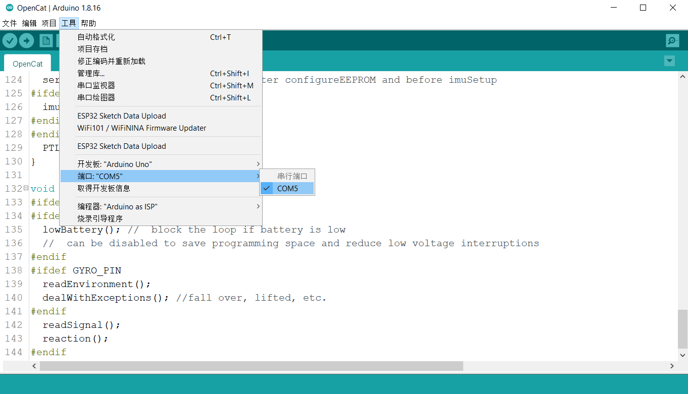

# 串口监视器

## 连接USB适配器到主板

连接 USB 适配器到主板，并选择正确的串行端口。

您可以在“工具”菜单栏中选择“串口监视器”，或者单击右上角的按钮打开串口监视器窗口，如下图所示：

当使用BiBoard V1\_ \*主板时，请在串口监视器中设置为“**没有结束符**”，并将波特率设置为**115200**。如下图所示：

## 连接蓝牙模块到主板（可选功能）

具体步骤可参考[双模蓝牙模块中连接NyBoard](https://docs.petoi.com/v/chinese/tong-xin-mo-kuai/shuang-mo-lan-ya-mo-kuai#yu-nyboard-lian-jie)部分。

然后您可以在 Arduino IDE 的 “工具” -> “端口” 下选择它，使用方法与上述USB适配器相同。


在 Mac 电脑上，蓝牙模块可能会在多次上传程序后断开连接。 在这种情况下，请先在系统蓝牙设置界面删除设备，再重新添加蓝牙设备，配对并连接以恢复功能。



在矽递及其代理渠道销售的版本中不包含蓝牙模块，请向[support@petoi.com](mailto:support@petoi.com)咨询购买方式。


这样您就可以使用与 NyBoard 通信并更改其上的每个字节的终极接口 —— 串口监视器（基于[串口协议](https://docs.petoi.com/v/chinese/chuan-kou-xie-yi)向机器人发送指令）了。
