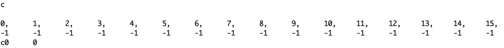
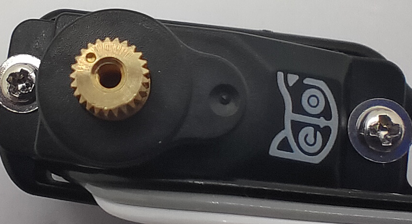

# 使用Arduino IDE 校准舵机


校准舵机对于机器人的正常运行至关重要。


校准舵机前请确保您已经上传了OpenCat[主程序固件](https://docs.petoi.com/v/chinese/arduino-ide/wei-nyboard-shang-chuan-cheng-xu#10.-shang-chuan-zhu-yao-gong-neng-cheng-xu) 。

## \* 校准舵机流程背后的逻辑：

1. 在校准之前，通电前我们不知道舵机将指向哪里。 所以如果躯干连接上腿部部件，腿会旋转到随机角度，并可能与机器人的身体或其他腿碰撞并被堵转。 如果一个舵机堵转了很长时间，它可能会损坏。
2. 进入[主板配置模式](https://docs.petoi.com/v/chinese/arduino-ide/wei-nyboard-shang-chuan-cheng-xu#2.-jin-ru-zhu-ban-pei-zhi-mo-shi)（注释掉OpenCat.ino 中的 `#define MAIN_SKETCH` 并上传）后，您需要在出现[清除校准数据](https://docs.petoi.com/v/chinese/arduino-ide/wei-nyboard-shang-chuan-cheng-xu#7.-qing-chu-xiao-zhun-shu-ju)提示时输入“Y”或“n”。 之后，所有的技能数据都会保存到控制器的静态内存中。 其中包括一个“校准”技能，这是一个所有关节都处在零位置的姿势。
3. 上传[标准功能程序](https://docs.petoi.com/v/chinese/arduino-ide/wei-nyboard-shang-chuan-cheng-xu#10.-shang-chuan-zhu-yao-gong-neng-cheng-xu)（启用OpenCat.ino 中的`#define MAIN_SKETCH` 并上传）后，您可以在[串口监视器](https://docs.petoi.com/v/chinese/arduino-ide/chuan-kou-jian-shi-qi)中输入“c”来校准关节。 该程序将读取“校准”姿势并将舵机旋转到已知位置。 所有舵机都应该从休息姿势旋转到校准位置。 然后你可以一个关节一个关节地连接腿部部件，连接时尽量垂直于周围的身体框架。

进入校准模式需要做好以下准备：

‌1. 全部舵机线路与主板连接好

2\. 电池电量充足

3\. 连接好[USB适配器并能正常通信](https://docs.petoi.com/v/chinese/tong-xin-mo-kuai/usb-xia-zai-mo-kuai-ch340c#lian-jie-nyboard)

如果您尝试跟换机器人舵机配件等，请在校准之前不要安装头，腿组件的螺丝。 您还需要安装电池并长按电池上的按钮为机器人供电。

校准分为三个步骤：

1. 进入校准模式，使舵机自由转动到中位；
2. 安装各个肢体到校准位；
3. 通过串口监视器微调关节修正量。

## 1. 进入校准模式

检查所有舵机接头插入的位置和方向，您**必须**把舵机和外接电池都插上NyBoard后才可以正确校准。 在我们安装腿部组件之前，舵机的输出轴应该处于零状态（转到中位然后停下）。

在串口监视器输入`c`来进入校准模式，舵机应该迅速地依次转到中位然后停下，同时齿轮箱会发出一些声响。由于舵机的起始位置各不相同，有些舵机的转角会大一些。在串口监视器会打印出一列表：

第一行是关节序号，第二行是它们的修正量，第三行是刚刚输入的校准指令。

| **Index**  | 0  | 1  | 2  | 3  | 4  | 5  | 6  | 7  | 8  | 9  | 10 | 11 | 12 | 13 | 14 | 15 |
| ---------- | -- | -- | -- | -- | -- | -- | -- | -- | -- | -- | -- | -- | -- | -- | -- | -- |
| **Offset** | -1 | -1 | -1 | -1 | -1 | -1 | -1 | -1 | -1 | -1 | -1 | -1 | -1 | -1 | -1 | -1 |

初始的关节修正量是 “-1” 或 “0”，需要测定后修改。


模型舵机用电位器作为位置环反馈的传感器。在保持某目标角度时，可能会有轻微抖动。舵机厂可以通过调整PID参数来抑制这种抖动，但随着电位器触点的磨损，这种“帕金森”症状会加重，但主要影响静态姿势的保持，在动态中并不明显。高端舵机可能会用贵上10倍的成本来解决这个问题，对我们而言，更换老化的舵机是更加经济的方案。


## 2. 安装舵机关联部件

### 2.1 坐标系

输入‘c’指令后，所有舵机都转到了中位，就可以安装之前组装好的舵机关联部件了。它们基本上按照相互垂直的角度互相连接，校准姿势如下图所示:

<figure><figcaption></figcaption></figure>


把舵机关联部件直插到舵机输出轴上，这过程中不要转动舵机输出轴。


关节角使用本体极坐标系，以逆时针转动为正。从机身左侧看，关节逆时针转动定义为正方向。


对于Nybble头的俯仰关节例外，因为我们习惯说“抬头”，直觉上是正方向，但从左侧看是顺时针转动。



但从机身右侧看，转动方向的正负性刚好相反。


### 2.2 离散的角度间隔

如果我们仔细观察舵机输出轴，可以发现它上面有一定数量的齿，这些齿可以防止输出轴在转动时相对摇臂滑动。在我们的舵机上，输出轴的圆周被分隔成25个齿，每个齿间隔14.4度（偏移 -7.2\~7.2 度）。这意味着我们安装关节时不可能绝对垂直，只能尽可能地接近垂直。

## 3 使用串口监视器对机器人进行精细校准

### 3.1 关节控制命令

校准的指令格式（参考[串口协议](https://docs.petoi.com/v/chinese/chuan-kou-xie-yi)）是`cIndex Offset`，Index是舵机编号， Offset是校准修正量。注意Index和Offset之间有空格。 机器人舵机编号如下图所示：

<figure><figcaption></figcaption></figure>

比如:

`c8 6`表示给8号舵机+6度的修正量。对于每个舵机都需要进行这样的校准以使各部位转动到校准位。

c0 -4 表示给0号舵机-4度的修正量。


修正量的分辨率是1度，不要使小数。



如果您发现需要的修正量的绝对值大于9度，那说明您在安装肢体时不够靠近校准位，这会导致该关节的有效行程不对称，在某一侧的可到达角度范围变小。把这个肢体取下来，转一个齿的角度重新安装，就可以得到一个方向相反，但是绝对值更小的修正量。



比如，如果您必须使用 -9 作为校准值，请将肢体取下，旋转一颗牙齿，然后再装回去。 新的校准值应该在 5 左右，即它们的绝对值总和为 14。在重新安装时，避免旋转舵机的输出轴。


找到可以使肢体达到零状态的最佳偏移量。 这是一个反复试验的过程。

校准后，**记得要输入`s`来保存修正量**，否则程序重启后它们就失效了。您甚至可以每校准一个舵机就保存一次。

### &#x20;3.2 校准支架

实际测量时，我们的观测会由于透视关系而产生偏差，这也是为什么我们在读直尺的刻度时要尽量在尺的上方平视。

在校准机器人的关节时，保持平视也特别重要，所以我们提供了校准支架辅助参考。按**先调4个肩关节（8\~11）后调4个膝关节（12\~15）**&#x7684;顺序依次校准，目标是使机器人大腿和支架的轮廓对齐，如何再对齐小腿。

<figure><figcaption></figcaption></figure>

#### 辅助参考点

大腿和肩膀之间、小腿和大腿之间，都有一个小圆点，对齐圆点，可以实现粗略的90度。

### 3.3 验证校准效果

校准后，可在串口监视器输入`d`或`kbalance`验证效果。机器人会在对应的休息和站立姿势间切换，它的四肢应该是前后、左右对称的。

&#x20;您可能需要进行几轮校准才能达到最佳状态。

<figure><figcaption></figcaption></figure>

### 3.4 调节重心

试着了解机器从如何在步行过程中保持平衡。如果要向机器人身体上添加新部件，请尽最大努力在脊柱周围对称分布其重量。也可以前后滑动电池座，以找到最佳的平衡位置。由于电池的前半部分较重，必要时您也可以反向插入电池，以使重心更多地向后移动。


如果重心发生变化，您可能需要重新校准。


请不要强行为机器人增加过重的物品，可能导致舵机扫齿或卡住。
