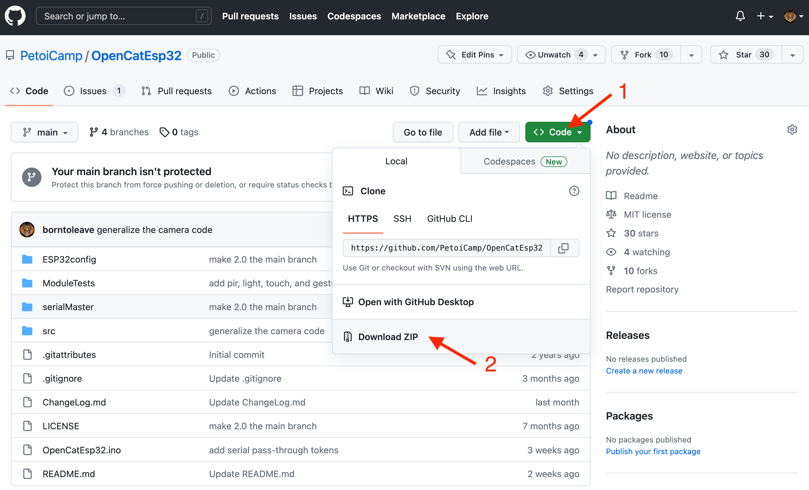
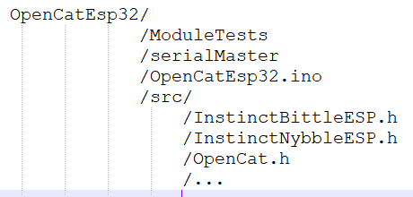

# 为BiBoard上传程序

## 1. 阅读快速上手指南

BiBoard 各功能模块具体参数，请根据主板型号，参考相关技术文档。

* [BiBoard V1 用户指南](https://docs.petoi.com/chinese/biboard/biboard-v1-yong-hu-zhi-nan)

## 2. 下载和安装软件环境

### 2.1 准备ESP32开发环境

详情请参考 BiBoard V1 用户指南

### 2.2 修改库代码文件

#### sdkconfig.h


* Windows 路径：

C:\Users\\{username}\AppData\Local\Arduino15\packages\esp32\hardware\esp32\2.0.\*\tools\sdk\esp32\qio\_qspi\include\sdkconfig.h

* Mac 路径：

/Users/{username}/Library/Arduino15/packages/esp32/hardware/esp32/2.0.\*/tools/sdk/esp32/qio\_qspi/include/sdkconfig.h


在文档最后追加一行代码：

```cpp
#define CONFIG_DISABLE_HAL_LOCKS 1
```

### 2.3 配置开发板参数

请参考下图中选项列表设置主板的上传速度(Upload Speed)、CPU 频率(CPU Frequency)等参数。 选项中关于 Flash Size 和 Partition Scheme 的设置，请参阅下一节。

<figure><figcaption></figcaption></figure>

### 2.4 设置硬件分区方案

BiBoard V1 使用带有 4M 闪存的 ESP32，这个配置方案目前已有足够的空间用来上传OpenCatEsp32 固件。

#### 4MB 分区方案

您可以使用默认的带有 spiffs  4MB分区方案。您也可以使用 4 MB 闪存限制下的其他分区方案，例如“无 OTA”或“Huge APP”。

<figure><figcaption></figcaption></figure>

### 2.5 下载OpenCatEsp32代码包并安装库文件


我们一直将代码更新为一个开源项目。您可以加星标并关注我们的GitHub代码仓库以获取最新功能和错误修复。您还可以与全球OpenCatEsp32用户共享代码。

欢迎提交代码！


1. 从GitHub下载最新的OpenCatEsp32代码包：[https://github.com/PetoiCamp/OpenCatEsp32](https://github.com/PetoiCamp/OpenCatEsp32)。\
   建议使用GitHub桌面应用程序进行版本控制。否则，请确保每次下载全部的OpenCatEsp32代码压缩包。所有代码文件必须在同一版本中，才能正常编译使用。

<figure><figcaption></figcaption></figure>

2. 解压缩代码压缩包（zip文件）。\
   解压缩后将获得一个OpenCatEsp32-main文件夹。您需要在打开OpenCatEsp32.ino之前，将其重命名为**OpenCatEsp32**（Arduino IDE 要求工程项目代码文件必须放在同名文件夹中）。


无论您将文件夹保存在何处，文件结构应如下图所示：




* ModuleTests文件夹中有几个名为testX（X代表功能模块，比如蜂鸣器Buzzer，陀螺仪MPU）.ino的代码。您可以上传它们分别测试对应模块的功能。打开任何带有前缀“ test”的testX.ino的工程。 （建议您使用testBuzzer.ino作为第一个测试项目）。

3.  在库管理器中安装最新版本的库文件(**ArduinoJson**)。\


    <figure><figcaption></figcaption></figure>


    <figure><figcaption></figcaption></figure>

### 2.6 使用USB type-C数据线连接电脑与主板

连接成功后，可以在**工具**菜单下查看串口名称（如下图所示）：

<figure><figcaption></figcaption></figure>

如果连接到电脑后找不到对应的串口名称，可以尝试通过以下几种方式解决问题：&#x20;


如果连接到电脑后找不到对应的串口名称，可以尝试通过以下几种方式解决问题：&#x20;

* 对于 BiBoard V1： 您需要按如下方式下载安装驱动程序：&#x20;
  * Windows：[https://www.wch.cn/downloads/CH343SER\_EXE.html](https://www.wch.cn/downloads/CH343SER_EXE.html)
  * Mac：[https://www.wch.cn/downloads/CH34XSER\_MAC\_ZIP.html](https://www.wch.cn/downloads/CH34XSER_MAC_ZIP.html)
* 如果主板使用电池供电，请长按电池上的按钮 >=3 秒关闭主板电源，这样主板仅通过 USB 数据线供电，并且只有蓝色 LED 亮起。


### 2.7 编译并上传程序

在**OpenCatEsp32.ino**文件中，根据您所使用的设备类型，修改设备类型宏定义。

```cpp
// #define BITTLE    //Petoi 9 DOF robot dog: 1 on head + 8 on leg
#  define NYBBLE  //Petoi 11 DOF robot cat: 2 on head + 1 on tail + 8 on leg
// #define CUB
```

根据您所使用的主板的[型号](broken-reference)，修改主板型号宏定义。

<pre class="language-cpp"><code class="lang-cpp">// #define BiBoard_V0_1  //ESP32 Board with 12 channels of built-in PWM for joints
<strong>// #define BiBoard_V0_2
</strong><strong>#define BiBoard_V1_0
</strong></code></pre>

Nybble  Q 机器人没有配带机械臂（Bittle R），请注释此行代码。：

```cpp
 // #define ROBOT_ARM                 // for attaching head clip arm 
```

修改完成后，点击**上传**按钮（如下图所示）上传程序，代码中的更改部分会自动保存。

<figure><figcaption></figcaption></figure>

### 2.8 程序初始化

如果当前上传程序代码的**版本日期**比机器人主板固件的版本日期**更新**时，程序上传完成后，会自动进入**初始化启动模式**。


请打开串口监视器，并将参数设置为 **115200** 波特率 并且 **没有结束符**。\
.png>)\
\
.png>)



* 您可以在源代码文件(_OpenCatEsp32/src/OpenCat.h_)中查看**当前上传程序代码**的版本日&#x671F;**：**\
  `#define DATE "250218"  // YYMMDD`
*   您可以在串口监视器中，发送串口命令 “**?**” (英文字符) 查看机器人**主板固件**的版本日&#x671F;**：**\


    <figure><figcaption></figcaption></figure>


在主板上电启动时，打开串口监视器，您将看到相关的启动信息：

```
ets Jun  8 2016 00:22:57

rst:0xc (SW_CPU_RESET),boot:0x1b (SPI_FAST_FLASH_BOOT)
configsip: 0, SPIWP:0xee
clk_drv:0x00,q_drv:0x00,d_drv:0x00,cs0_drv:0x00,hd_drv:0x00,wp_drv:0x00
mode:DIO, clock div:1
load:0x3fff0030,len:1344
load:0x40078000,len:13964
load:0x40080400,len:3600
entry 0x400805f0
k
Flush the serial buffer...

* Start *
Bittle X
Software version: B02_250121
Scanning I2C network...
- I2C device found at address 0x54:	EEPROM
- I2C device found at address 0x5C:	Misc.
- I2C device found at address 0x68:	MPU6050
- I2C device found at address 0x69:	ICM42670
- I2C device found at address 0x7E:	Misc.
- done
GroveVisionQ	0
MuQ	0
Set up the new board...
Unmute and set volume to 5/10
Using constants from I2C EEPROM
- Name the new robot as: Bittle45
```


如果您打开串口监视器后，没有看到相关启动信息，请短按一下主板上的复位(Reset)按钮。


接下来您将看到以下提示问题：

```cpp
Reset the joints' calibration offsets? (Y/n):  // 是否清除所有舵机的校准参数？‌‌
```

* 发送英文字符“Y”，把所有舵机的修正值归零。
* 发送英文字符“n”, 跳过此步骤。


如您需保留之前的关节校准数据，请发送英文字符“‘n’。


```cpp
- Calibrate the Inertial Measurement Unit (IMU)? (Y/n):  // 是否校准IMU（MPU6050）？
```

* 发送英文字符“Y”，校准 IMU（陀螺仪/加速度计传感器）。
* 发送英文字符“n”, 跳过此步骤。


如您需保留之前的校准陀螺仪数据，请发送英文字符“‘n’。



将BiBoard平放在水平桌面上，校准时不要触摸它。

有时程序可能会在连接阶段中止。 您可以关闭串口监视器并重新打开它，或按 BiBoard 上的复位（Reset）按钮，重新启动程序。

程序在播放6次音效后开始校准IMU。


```
Run factory quality assurance program? (Y/n)        // 运行工厂质检程序
```

发送英文字符“n”, 跳过此步骤。或者您什么也不需要做，程序将在 5 秒后自动跳过此步骤。

与提示问题相关的串口打印信息详情如下：

```cpp
* Start *
Scanning I2C network...
- I2C device found at address 0x54  !
- I2C device found at address 0x68  !
- done
Set up the new board...
// 蓝牙连接时使用的设备名称
- Name the new robot as: BittleED    
Reset the joints' calibration offsets? (Y/n): 
Y
Buzzer volume: 5/10
- Calibrate the Inertial Measurement Unit (IMU)? (Y/n): 
Y

Put the robot FLAT on the table and don't touch it during calibration.

Initializing MPU6050...
OK
If the program stucks, reinstall Arduino ESP32 boards version 2.0.12. Newer version may cause bugs!
- Testing MPU connections...attempt 0
- MPU6050 connection successful
- Initializing DMP...
MPU offsets: 2691	1893	1181	72	-57	0	
Calibrate MPU6050...
>....................>....................
MPU offsets:
//           X Accel  Y Accel  Z Accel   X Gyro   Y Gyro   Z Gyro
//OFFSETS     2759,    1871,    1173,      73,     -56,      -4
- Enabling DMP...
- DMP ready! Waiting for the first interrupt...
BLE:		Bittle45_BLE
Waiting for a BLE client connection to notify...
SSP:		Bittle45_SSP
The SSP device is started, now you can pair it with Bluetooth!
Setup ESP32 PWM servo driver...
Calibrated Zero Position
135	225	135	135	190	80	190	80	190	80	80	190	
Build skill list...88
Run factory quality assurance program? (Y/n)
(Auto skip in 5 seconds)
5...4...3...2...1...n
TaskQ
rest
11
Init voice
Number of customized voice commands on the main board: 
10
Turn on the audio response
Show Petoi Logo color
S,	A,	T,	L,	D,	I,	B,	U,	G,	C,	Q,	
0,	1,	0,	0,	0,	0,	0,	0,	0,	0,	0,	
Ready!
g
rest
d
XAaXAc
Switch English

```

当看到串口监视器中输出字符串“<mark style="color:green;">Ready!</mark>”时，程序将进入**常规启动模式**。

主板在**每次上电启动时**，通过比对EEPROM 中的BIRTHMARK，判断程序有没有被初始化过。如果程序已被初始化，则**不会再次进入**初始化启动模式。


**注意**：主板在上电启动时，**常规启动模式**与**初始化启动模式，**&#x64AD;放的音乐旋律是**截然不同**&#x7684;**。**&#x8FD9;样方便用户（不需要打开串口监视器），也能识别出主板的启动模式。

如果你需要清除舵机的校准参数，并重新校准关节舵机，或者重新校准IMU，您可以在串口监视器中发送串口命令 “<mark style="color:red;">**!**</mark>” (英文字符)，程序会**重新进入**初始化启动模式。


### 2.9 发送串口命令切换工作模式(选做) <a href="#id-2.8-swith-mode-via-the-serial-commands-optional" id="id-2.8-swith-mode-via-the-serial-commands-optional"></a>

程序默认运行语音模式。如果您想切换模式，请打开串口监视器并发送以下串行命令：

<table><thead><tr><th width="172">串口命令</th><th>功能</th></tr></thead><tbody><tr><td>XA</td><td>语音模式（默认模式）。对于BiBoard V0主板，需要将扩展板上的拨动开关拨到 <strong>Voice command</strong> 一侧。</td></tr><tr><td>XU</td><td>超声波模式。对于BiBoard V0主板，需要将扩展板上的拨动开关拨到 <strong>Uart2</strong>一侧。</td></tr><tr><td>XC</td><td>摄像头模式</td></tr><tr><td>XL</td><td>光强传感器模式</td></tr><tr><td>XT</td><td>触摸传感器模式</td></tr><tr><td>XI</td><td>人体移动探测器模式</td></tr><tr><td>XG</td><td>手势识别传感器模式</td></tr><tr><td>XD</td><td>红外测距传感器模式</td></tr><tr><td>XQ</td><td>简单演示模式</td></tr><tr><td>XS</td><td>开启第二串口(Tx2, Rx2)。 对于BiBoard V0主板，需要将扩展板上的拨动开关拨到 <strong>Uart2</strong>一侧。</td></tr><tr><td>XB</td><td>开启背部触摸功能</td></tr><tr><td>X</td><td>关闭上述所有模式功能</td></tr><tr><td>z</td><td>开启/关闭机器人随机动作（开启后，每隔一定时间做各种随机动作）</td></tr></tbody></table>


官方模块的行为在 OpenCatEsp32/src 中的单独头文件中定义。您可以在 OpenCatEsp32/src/moduleManager.h -> readSignal() 中找到它们。简单演示模式的行为在 OpenCatEsp32/OpenCatEsp32.ino -> quickDemo() 中定义。您可以研究示例代码来编写您的函数。

您可以通过[扩展模块](https://docs.petoi.com/chinese/kuo-zhan-mo-kuai/kuo-zhan-mo-kuai-gai-yao-shuo-ming)了解每个模块的功能。


### 2.10 上电开机

* 长按电池上的电源按钮，保持机器人身体侧立开机（如下图所示），主板程序在**常规启动模式**下会自动进入关节校准状态。 下图是安装好身体各部件后，机器人进入关节校准状态后的身体姿态。
*

    <figure><figcaption></figcaption></figure>

详细的关节校准流程请参考 手机应用 的 [关节校准页面](../shou-ji-ying-yong/guan-jie-jiao-zhun.md)

* 当机器人上电时，身体正放（背部朝上），主板程序在**常规启动模式**下，机器人将从“休息”姿势（四肢收缩，并且所有舵机处于释放状态）启动。

## 3. 使用移动App操控

BiBoard 内置蓝牙，您可以将其与移动App ([Petoi](https://docs.petoi.com/chinese/shou-ji-ying-yong/zong-lan)) 连接，进行[关节校准](https://docs.petoi.com/chinese/shou-ji-ying-yong/guan-jie-jiao-zhun) 与 [遥控](https://docs.petoi.com/chinese/shou-ji-ying-yong/kong-zhi-mian-ban)。

您可以在 [ChangeLog.md](https://github.com/PetoiCamp/OpenCatEsp32/blob/main/ChangeLog.md) 中查阅程序更新历史信息。
