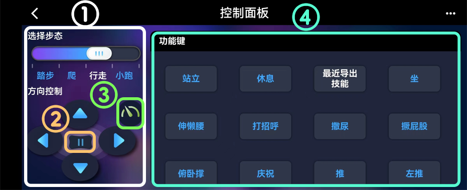

# 控制面板

在控制面板中，您可以控制机器人执行各种姿势、行为和步态。

<figure><figcaption></figcaption></figure>

## 步态 <a href="#bu-tai" id="bu-tai"></a>

①左侧面板设置机器宠物的步态和方向，并发送组合命令，例如“向左走”和“向前小跑”。 只有选择了初始步态和方向，机器宠物才会移动。 选择“踏步”，机器宠物只是原地踏步，当选择了“爬”，“行走”，“小跑”步态后，单击方向按钮“向后”之后，接着按“左”（或者“右”）按钮，可以让机器宠物向左后退（或者向右后退）。&#x20;

②暂停按钮 “**||**” 将暂停机器宠物的运动并关闭所有的舵机，以便您可以将关节旋转到任何角度。&#x20;

③“加速器”按钮（）用来加速机器宠物的行进。默认为关闭状态，按钮绿色、指针向左；点击按钮即可打开加速，按钮变为橙色、指针向右。&#x20;

加速通过提高陀螺仪频率实现，因此如果关闭加速，机器人会减少内部数据计算，走得更快更稳定。

## 姿势和行为 <a href="#zi-shi-he-hang-wei" id="zi-shi-he-hang-wei"></a>

④内置的姿势和行为可以通过按下“**功能键**”区域的按钮来触发。 建议不要过于频繁和重复地按下按钮。 给机器宠物一些时间来完成它当前的动作。

## 自定义命令 <a href="#zi-ding-yi-ming-ling-dong-zuo" id="zi-ding-yi-ming-ling-dong-zuo"></a>

**长按按钮并拖动**，可以改变按钮位置；**双击**命令按钮可以对它进行编辑；您还可以通过按 “**+**” 按钮增加自定义的单一命令或者组合命令；

<figure><figcaption></figcaption></figure>

### 创建单个命令 <a href="#chuang-jian-dan-ge-ming-ling" id="chuang-jian-dan-ge-ming-ling"></a>

按下**创建命令**按钮后，你将看到以下命令编辑界面：

<figure><figcaption></figcaption></figure>

进入编辑状态后，显示一个精简的串口命令控制台（如上图所示），可以用来测试串口命令，控制机器人做各种动作。

您可以在**代码**文本框中输入以下常用的串口指令：

**\* 扭头 （旋转脖子舵机角度）**

```
m0 45
```

**\* 左右扭动头部（移动 关节1 角度1 关节2 角度2 .... 角度为-127\~128）**

```
m0 -70 0 70
```

**\* 坐**

```
ksit
```

**\* 按顺序依次移动关节**

```
m 0 -70 0 70 8 -30
```

**\* 同时移动多个关节**

```
i 0 -45 8 -30 12 -60
```

供您参考，以下是关节的索引。您可以仔细观察排序的模式并试着记住它们。

<figure><figcaption></figcaption></figure>

**\* 显示当前关节角度**

```
j
```

**\* 长“喵”一声 (Nybble)**

```
u0 1
```

**\* 短“喵”三声 (Nybble)**

```
u2 20
```

**\* 播放短音（蜂鸣音 持续时间为 0\~256）**

```
b12 100
```

**\* 播放旋律（b音调 1 持续时间 1，音调 2 持续时间 2，音调 3 持续时间 3，.... 仅允许 64 个字符，其中持续时间为数字的倒数，即记谱法中的“几分之一音符”）**

```
b14 4 14 4 21 4 21 4
```

更详细的命令说明表格请参考文档中心[串口协议](https://docs.petoi.com/v/chinese/chuan-kou-xie-yi)章节。

### 将新技能导入为自定义按钮 <a href="#jiang-xin-ji-neng-dao-ru-wei-zi-ding-yi-an-niu" id="jiang-xin-ji-neng-dao-ru-wei-zi-ding-yi-an-niu"></a>

#### 导入本地创作的技&#x80FD;**（**[**技能创作坊**](https://docs.petoi.com/v/chinese/zhuo-mian-ying-yong/ji-neng-chuang-zuo-fang)**）**

您可以使用通讯软件（比如微信）或电子邮件将电脑中创作的技能文件发送到您的手机，并使用 Petoi 应用程序在手机上打开该文件。此操作将自动为新技能创建一个按钮， 打开控制面板就可以看到。

<figure><figcaption></figcaption></figure>

**导入GitHub技能库中的技能**

Github中的[SkillLibrary文件夹](https://github.com/PetoiCamp/OpenCat/tree/main/SkillLibrary)是OpenCat 机器人的新技能的集合，可以供您参考。您可以用手机浏览器访问OpenCat工程的GitHub页面，打开技能文件（比如 [Bittle\_Fold.md](https://github.com/PetoiCamp/OpenCat/blob/main/SkillLibrary/Bittle/Bittle_Fold.md)），将其分享到手机应用[Petoi](https://docs.petoi.com/v/chinese/shou-ji-ying-yong/zong-lan)，如下图所示，即可通过命令按钮来执行此技能。


在iOS设备中，您可能无法通过Chrome浏览器将Github网站上的技能文件直接分享到 Petoi 手机app。您可以在Chrome浏览器先下载技能文件到本机。然后再参照[导入本地创作的技能](kong-zhi-mian-ban.md#dao-ru-dian-nao-ben-di-ji-neng-chuang-zuo-fang-chuang-zuo-de-ji-neng)方法导入到到 Petoi 手机app中。



同时欢迎您通过向[此文件夹](https://github.com/PetoiCamp/OpenCat/tree/main/SkillLibrary)发送合并请求来分享您创作的新技能。

### 创建组合命令 <a href="#chuang-jian-zu-he-ming-ling" id="chuang-jian-zu-he-ming-ling"></a>

按下**创建组合命令**按钮后，您可以看到以下界面：

<figure><figcaption></figcaption></figure>

您可以在“**名字**”文本框中为组合命令组命名，并通过单击“**指令库**”选择框中的命令按钮将命令添加到“**组合指令**”列表中。 在**组合指令**列表中，您可以按住单个指令的按钮并拖动来更改单个指令的位置。

单击**Test**或**播放(****)** 按钮可以测试组合指令的执行效果。在组合命令执行过程中，单击**暂停(** **)**&#x6309;钮, 可以中断执行流程。

单击**删除**按钮，可以删除此组合指令。

## 更新和支持 <a href="#geng-xin-he-zhi-chi" id="geng-xin-he-zhi-chi"></a>

我们会不断改进应用程序，并会在可用时通知您更新。 如果您对该应用程序有任何疑问，请写信至 [support@petoi.com](mailto:support@petoi.com)。 &#x20;

[\
](https://docs.petoi.com/chinese/shou-ji-ying-yong/guan-jie-jiao-zhun)
