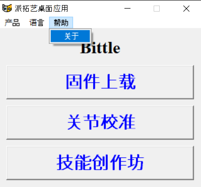
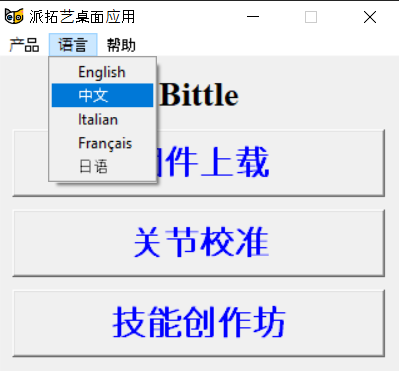

# 固件上载

## 语言\*\* 下载最新版的桌面应用程序 [Petoi Desktop App](https://github.com/PetoiCamp/OpenCat/releases) \*\*


* 下载完成压缩文件（.zip）后，请对其解压缩后再使用。
* Windows用户，请不要将 UI.exe 移动到其他文件目录。


下载完成压缩文件（.zip）后，请对其解压缩后再使用。

Windows用户，请不要将 UI.exe 移动到其他文件目录。

* 下载完成压缩文件（.zip）后，请对其解压缩后再使用。
* Windows用户，请不要将 UI.exe 移动到其他文件目录。

关于BiBoard更详细的规格参数请参考 [BiBoard V0 快速上手指南](https://docs.petoi.com/v/chinese/kuai-su-shang-shou-zhi-nan)。

## **BiBoard**

**BiBoard** 主板型号（版本信息)，可参考图示位置：

<figure><figcaption></figcaption></figure>

## 使用 Petoi Desktop APP 上载固件 

### 下载最新版[桌面应用程序](https://github.com/PetoiCamp/OpenCat/releases) 


不同计算机可能存在一些操作系统平台兼容性问题。 但您仍然可以直接从终端(windows: Command Prompt; Linux / Mac OS: Terminal )运行该应用程序：

1. 在终端中将文件路径切换到 OpenCat/pyUI/。
2. 为你的 Python3 安装 pyserial，Pillow 。 你也可以创建一个干净的 Anaconda Python3虚拟环境和使用使用命令 **pip3 install pyserial Pillow** 安装必要的库文件。
3. 运行 **python3 UI.py** 命令启动应用程序。


对于BiBoard，固件上传主要是调用应用程序 esptool 来为主板上传固件文件


#### Linux系统中安装 avrdude

对于Linux系统用户，除了上述步骤，你还需要执行以下步骤：

1\. 安装 avrdude

* Fedora : dnf install avrdude
* CentOS : yum install avrdude
* Debian / Ubuntu : apt install avrdude

2\. 修改FirmwareUploader.py中的变量 avrdudeconfPath

* Fedora / CentOS : `avrdudeconfPath = '/etc/avrdude/'`
* Debian / Ubuntu : `avrdudeconfPath = '/etc/'`


#### Linux系统中安装 avrdude

### 连接USB上载器 

### 打开 **Petoi Desktop App** 

USB上载器正确连接后，打开 **Petoi Desktop App**（Windows：UI.exe / Mac：Petoi Desktop App / Linux: Petoi-opencat），选择 **产品** 和 **语言**。

### **Petoi Desktop App中的菜单栏**

<figure><figcaption>
产品类型
</figcaption></figure> <figure><figcaption>
帮助
</figcaption></figure> <figure><figcaption></figcaption></figure>


法语，日语……等版本还未完成翻译。欢迎为我们的 GitHub 代码仓库做贡献：OpenCat/pyUI/translate.py。


### 点击“固件上载”按钮 

<figure><figcaption>
主界面
</figcaption></figure>

<figure><figcaption>
固件上载器界面
</figcaption></figure>

### 选择正确的选项 


注意：1.0 版软件无法与 **关节校准**、**技能创作坊** 及其他 API 一起正常工作。此版本固件仅在您需要使用 CodeCraft（我们的合作伙伴 TinkerGen 提供的图形化编程工具）时使用。


选项可供选值备注

| 选项   | 可供选值                                                                                                        | 备注                                            |
| ---- | ----------------------------------------------------------------------------------------------------------- | --------------------------------------------- |
| 软件版本 | 
1.0  2.0（默认）
                                                                                      | 1.0 版本将过时                                     |
| 主板型号 | 
NyBoard_V1_0 NyBoard_V1_1 NyBoard_V1_2（默认） BiBoard_V0_1  BiBoard_V0_2 BiBoard_V1_0
       | 
Nybble Q机器人使用  BiBoard_V1_0
         |
| 产品   | 
Bittle（默认） Nybble  Bittle X Nybble Q
                                                        | Nybble Q                                      |
| 模式   | 
标准（默认）

随机 

语音 

Mind+ 

摄像头（ Bittle） 

超声波（Nybble） 

随机_ 超声波（Nybble）
 | 某些模式仅适用于特定产品，当您在产品和主板型号之间切换时，它应该会自动更新允许的模式列表。 |
| 串口   | 自动检测或手动选择                                                                                                   | 您可以通过重新拔插电脑端的USB接口找到                          |


**主板型号**（硬件版本）和 **软件版本** 之间没有任何关联。


### **固件上载选项按钮**

#### **固件上载流程**

单击“上传”按钮后，上传过程立即开始。 底部状态栏会实时显示当前进度，以及关键流程的结果。

参数固件上传成功后，主板开始自动运行配置程序。 会依次弹出一些消息窗口供您确认或取消：

1. 舵机校准参数清零? (Y/N)

<figure><figcaption></figcaption></figure>

选择点击“是(Y)”，程序会将所有舵机校准参数清零，状态栏会实时更新相应的过程和结果。

选择点击“否(N)”，程序将跳过此步骤。


对于 1.0 版本软件，会弹出 “更新技能? (Y/N)” 的警告信息窗口，如下所示：

选择“是(Y)”，程序会更新所有技能配置参数，状态栏会实时更新相应的流程和结果。

选择“否(N)”，程序将跳过此步骤。

如果您是第一次上传这个版本的软件，请务必选择点击 “**是(Y)**”！

对于 2.0 版本软件 ，此选项会在后台自动处理为 Y。


2\. 校准 IMU? (Y/N)

<figure><figcaption></figcaption></figure>

选择点击“是(Y)”，程序会校准陀螺仪（IMU），状态栏会实时更新相应的过程和结果。

选择点击“否(N)”，程序将跳过此步骤。


注意：

1. 在点击“是(Y)”按钮之前，**请确保将 主板 水平放置**。
2. 首次上传不同的版本固件时，请务必点击“**是(Y)**”按钮！


完成所有步骤后，将弹出一个消息窗口，显示“参数初始化完成！” 您需要确认进行第二轮上传主程序固件。

<figure><figcaption></figcaption></figure>

主程序固件上传完成后，状态栏会更新固件上传成功或失败等相应结果。 如果上传成功，则会弹出“固件上传完成！”消息窗口。

<figure><figcaption></figcaption></figure>


注意：

* 首次打开桌面应用软件上传固件时，程序会先上载“参数”固件，再上载“主程序”固件。 如果上载成功后重新上传，只是修改了“模式”选项，应用软件只上载“主程序”固件。
* 如果 BiBoard未连接电池或者未打开电源供电，固件上传成功后，您会听到重复的下降旋律，表示电池电量低。 您需要连接电池并打开其电源供电。


如果您有 Arduino IDE 编程经验，可以参考使用 Arduino IDE 上载程序固件。
