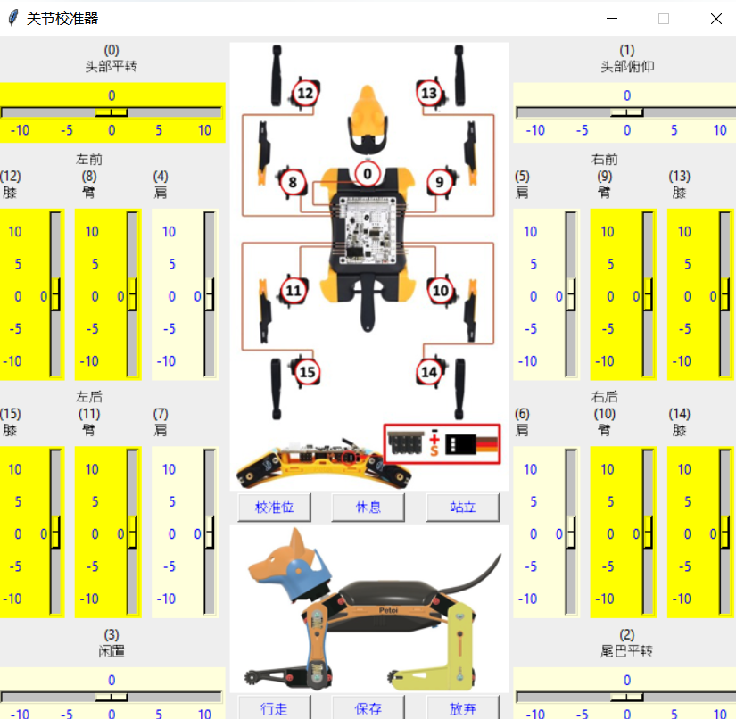

# 关节校准

## \*\* 下载最新版的桌面应用程序 [Petoi Desktop App](https://github.com/PetoiCamp/OpenCat/releases) \*\*


* 下载完成压缩文件（.zip）后，请对其解压缩后再使用。
* Windows用户，请不要将 UI.exe 移动到其他文件目录。



Nybble Q 机器人出厂前已经校准完毕，如果您需要更换舵机，则需要重新校准。

校准前请确保您已经上传了OpenCat[<mark style="color:purple;">主功能固件</mark>](https://github.com/PetoiCamp/OpenCat/releases) 的2.0版。

建议在给舵机发送校准信号前，先不要把机器人身体和腿组装起来，可先不要拧上螺丝，因为可能需要拆下来重新对准角度。


打开[**Petoi Desktop App**](https://github.com/PetoiCamp/OpenCat/releases)（Windows：UI.exe / Mac：Petoi Desktop App），选择 **产品** 和 **语言**。点击“**关节校准**”按钮，打开校准界面：\

<figure><figcaption></figcaption></figure>

## 关节校准界面


注意：在APP中，需要选择机器人类型，选择Nybble 机器人而不是  Bittle 机器人。

因为Nybble 比 Bittle多使用两个舵机（头部和尾部），因此Nybble 与 Bittle 舵机**关节索引号有所不同**，其次Nybble 与 Bittle 进入校准状态后的**校准姿势也有所不同**，如下图所示（界面中淡黄色背景区域中舵机滑块不可使用）：


<figure><figcaption>
Bittle
</figcaption></figure> <figure><figcaption>
Nybble
</figcaption></figure>

1. 点击“**校准位**”按钮，所有舵机输出轴立即转动到校准位置。
2. 在校准过程中请使用随附的 校准支架作为参考：

根据界面中间图示中的关节索引号（校准舵机时，先调整大腿，再调整小腿）。 拖动相应的滑块（在索引号下方），或点击滑块轨道的灰色部分将关节微调至直角状态。

<figure><figcaption></figcaption></figure>


如果校准偏移量超过+/- 9度，则需要将舵机的相应部分拆下，偏转一个齿位重新安装，然后按“+”或“-”按钮。

例如，如果您必须使用 -10 作为校准值，请将肢体取下，偏转一个齿牙，然后再将其装回。 新的校准值应该在 4 左右，即它们的绝对值总和为 14。

注意：在此调整过程中应避免旋转舵机输出轴。


您可以通过点击**休息**、**站立**、**行走**按钮来回切换状态，测试校准效果。


注意：您可能需要进行第二轮校准才能获得最佳校准效果。


校准完成后，记得点击“**保存**”按钮保存校准偏移量。 否则，单击“**放弃**”按钮放弃校准数据。 当然您也可以在校准过程中随时保存，以防连接发生中断丢失数据。


当您关闭界面窗口时，会弹出一个消息窗口，如下图所示：

如果要保存校准数据，请单击“**Yes**”按钮，否则单击“**No**”按钮。 单击“**Cancel**”按钮应用程序停留在当前界面。

